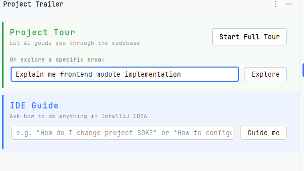
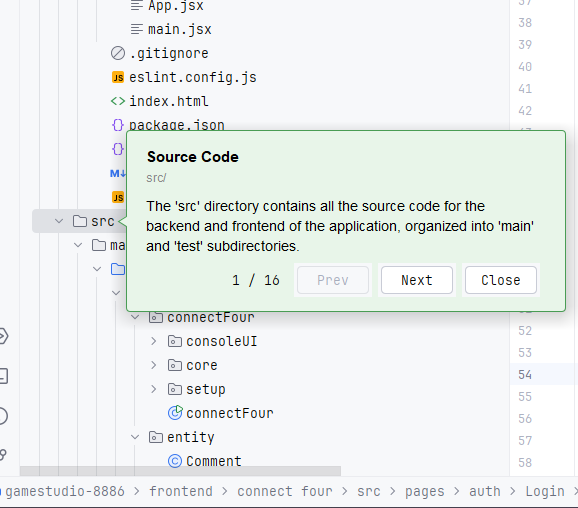

# ProjectTrailer

### IntelliJ IDEA plugin by team **Who_knows**.

ProjectTrailer is an IntelliJ Platform plugin that adds AI-assisted helpers to the IDE.

## Overview

ProjectTrailer makes onboarding to a new project faster and less painful, right inside IntelliJ IDEA.

### Core features

- **Message bubbles** — visual annotations that explain project structure inline, directly in the Project View.
- **Full project tour** — a guided, step-by-step walkthrough of the entire codebase.
- **Focused module tour** — ask about a specific module without going through the full project tour.
- **IDE helper** — can't find a setting or IDE feature? The plugin guides you directly to it.
- **AI chat** — a built-in chat for questions about the project or its code.
- **File explainer** — select any file and get a plain-language explanation of what it does.

### Screenshots






## Development

This project is built with Gradle and the [IntelliJ Platform Gradle Plugin](https://plugins.jetbrains.com/docs/intellij/tools-intellij-platform-gradle-plugin.html). See [`CLAUDE.md`](./CLAUDE.md) for an architecture overview and common commands.

### Quick plugin development boot

1. **Install prerequisites**
   - JDK 17+ (IntelliJ Platform 2025.2 requires JDK 21 at runtime — the Gradle toolchain resolver will fetch it automatically via `foojay-resolver-convention`).
   - IntelliJ IDEA 2025.2+ (Community or Ultimate). The Kotlin and Gradle plugins ship bundled.
   - Git.

2. **Clone and open**
   ```bash
   git clone https://github.com/Mishaguk/ProjectTrailer.git
   cd ProjectTrailer
   ```
   Open the folder in IntelliJ IDEA — the IDE will auto-import the Gradle project and download dependencies on first sync (this can take several minutes; platform artifacts are large).

3. **Configure the OpenAI key (optional, only if testing AI features)**
   Create `src/main/resources/env.local` with:
   ```
   OPENAI_API_KEY=sk-your-key-here
   ```
   This file is bundled into the plugin classpath, so keep it out of version control.

4. **Launch a sandbox IDE with the plugin loaded**
   ```bash
   ./gradlew runIde
   ```
   Or use the pre-made `Run Plugin` configuration in `.run/` (dropdown in the IDE toolbar → **Run Plugin**). A second IntelliJ instance will boot with ProjectTrailer installed. Find the tool window via **View → Tool Windows → ProjectTrailer**.

5. **Run tests**
   ```bash
   ./gradlew test
   ```
   Or use the `Run Tests` configuration in `.run/`.

6. **Verify the plugin against target IDE versions before publishing**
   ```bash
   ./gradlew verifyPlugin
   ```

7. **Build a distributable zip**
   ```bash
   ./gradlew build
   ```
   Output lands in `build/distributions/*.zip` — this is what you upload to JetBrains Marketplace or install manually.

#### Plugin based on the [IntelliJ Platform Plugin Template](https://github.com/JetBrains/intellij-platform-plugin-template).
